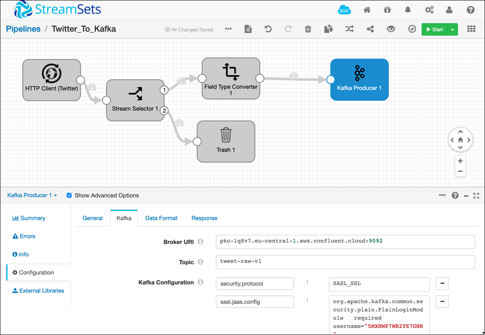
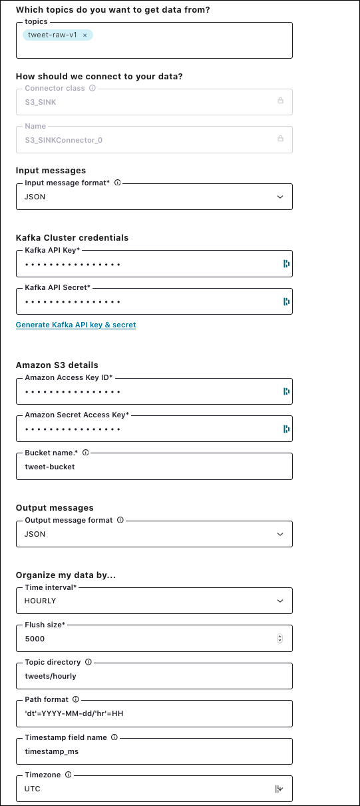

# AWS Dataplatform Demo

This demo shows how to ingest live Twitter data into Confluent Cloud running on AWS and from there either process it in real-time using the ksqlDB or moving it to S3 for later processing using Spark on EMR and Athena. 


## Preparation

Create the bucket `tweet-bucket` in AWS S3.

### Confluent Cloud

<https://confluent.cloud/login>

Create a cluster with the following topics:

* `tweet_raw_v1`

### StreamSets Data Flow

<http://35.159.49.190:18630>

The ingestion from Twitter to Confluent Cloud Kafka topic is implemented using StreamSets Data Collector. 

It retrieves the tweets via `HTTP Client` and sends it to Kafka using a `Kafka Producer`. 



<https://developer.twitter.com/en/docs/twitter-api/v1/tweets/filter-realtime/api-reference/post-statuses-filter>

`https://stream.twitter.com/1.1/statuses/filter.json?track=trump,aws,trivadis&follow=18898576`

### Using Confluent Cloud CLI to consume tweets

Login with user `schmutz68@gmail.com`

```
ccloud login
```

```
ccloud kafka topic consume tweet-raw-v1
```

### Kafka Connect

Configure Kafka Connect to move tweets to S3. Use the following settings:



After a while the data will be written to `s3://tweet-bucket/tweets/hourly`

### EMR

When creating the cluster in EMR, set the following configurations

```
[
  {
    "Classification": "livy-conf",
    "Properties": {
      "livy.impersonation.enabled": "true"
    }
  },
  {
    "Classification": "core-site",
    "Properties": {
      "hadoop.proxyuser.livy.groups": "*",
      "hadoop.proxyuser.livy.hosts": "*"
    }
  }
]
```


```
export EMR_HOST=ec2-3-120-151-197.eu-central-1.compute.amazonaws.com
```


Create an SSH tunnel 

```
ssh -i AwsDemo.pem -ND 8157 hadoop@$EMR_HOST
```

to use the following UIs:

* Zeppelin: <http://ec2-3-120-151-197.eu-central-1.compute.amazonaws.com:8890/>
* Spark History Server: <http://ec2-3-120-151-197.eu-central-1.compute.amazonaws.com:18080/>
* Livy: <http://ec2-3-120-151-197.eu-central-1.compute.amazonaws.com:8998/>
* Resource Manger: <http://ec2-3-120-151-197.eu-central-1.compute.amazonaws.com:8088/cluster>

### Using Zeppelin to write Spark code

Navigate to [Zeppelin](http://ec2-3-120-151-197.eu-central-1.compute.amazonaws.com:8890/) and load the notebook from: `./zeppelin/Tweet-Hashtag-Counts.json`.

Add the following setting to the `spark` interpreter

* `spark.jars.packages`:`io.delta:delta-core_2.11:0.6.1`

Loading the raw data

```scala
val tweetRawDf = spark.read.json("s3a://tweet-bucket/tweets/hourly/tweet-raw-v1")
```

Restricting on one month hour of data

```scala
import org.apache.spark.sql.functions._

case class Config(year: String = null,
                  month: String = null,
                  day: String = null,
                  hour: String = null)

val config = Config("2020", "09", "26", "16")

val tweetFilterDf = tweetRawDf.filter (s"dt = to_date('${config.year}${config.month}${config.day}','yyyyMMdd') and hr = '${config.hour}'")
```

count the data

```scala
tweetFilterDf.count()
```

show the schema of the raw tweet

```scala
tweetFilterDf.printSchema
```
The tweet object schema can be found [here](tweet-object.md).

create a temporary table

```scala
tweetFilterDf.createOrReplaceTempView("tweet_raw_t")
```

Use a `SELECT` statement to query parts of the data

```sql
%sql
SELECT dt, hr, id_str, created_at, SUBSTRING(text, 1, 100) text 
FROM tweet_raw_t
```

Use a `LATERAL VIEW EXPLODE` clause to flat map the hashtags

```sql
%sql
SELECT id, LCASE(hashtags) AS hashtag 
FROM tweet_raw_t 
LATERAL VIEW EXPLODE ( entities.hashtags.text) AS hashtags
```

Add a `GROUP BY` and `COUNT` around it to count the hashtags

```sql
%sql
SELECT to_date(from_unixtime(timestamp_ms / 1000, 'yyyyMMdd'), 'yyyyMMdd') at_date
        , from_unixtime(timestamp_ms / 1000, 'HH') at_hour
        , hashtag
        , count(hashtag) AS noByHour
FROM (
    SELECT timestamp_ms
            , id
            , LCASE(hashtags) AS hashtag 
    FROM tweet_raw_t 
    LATERAL VIEW explode ( entities.hashtags.text) AS hashtags
) 
GROUP BY hashtag 
        , to_date(from_unixtime(timestamp_ms / 1000, 'yyyyMMdd'), 'yyyyMMdd')
        , from_unixtime(timestamp_ms / 1000, 'HH')
```

create a new DataFrame with this `SELECT` statement

```scala
val hashtagCountDf = spark.sql("""
                SELECT to_date(from_unixtime(timestamp_ms / 1000, 'yyyyMMdd'), 'yyyyMMdd') at_date
                    , from_unixtime(timestamp_ms / 1000, 'HH') at_hour
                    , hashtag
                    , count(hashtag) noByHour
                FROM (
                    SELECT timestamp_ms
                        , id
                        , LCASE(hashtags) AS hashtag
                    FROM tweet_raw_t 
                    LATERAL VIEW EXPLODE ( entities.hashtags.text) AS hashtags
                    WHERE dt = to_date('${config.year}${config.month}${config.day}','yyyyMMdd') AND hr = ${config.hour}
                ) GROUP BY hashtag
                        , to_date(from_unixtime(timestamp_ms / 1000, 'yyyyMMdd'), 'yyyyMMdd')
                        , from_unixtime(timestamp_ms / 1000, 'HH')
""")
```

Write a delta table, if it does not yet exist:

```scala
hashtagCountDf.write
                .format("delta")
                .partitionBy("at_date", "at_hour")
                .save(hashtagCountPath);
```

otherwise merge the new data into the existing delta table

```scala
deltaTable.alias("oldData")
          .merge(hashtagCountDf.alias("newData"),
            "oldData.hashtag = newData.hashtag AND oldData.at_date = newData.at_date AND oldData.at_hour = newData.at_hour")
          .whenMatched().updateAll()
          .whenNotMatched().insertAll()
          .execute()
```

### Creating Spark Application 

Create a Scala application with the code from the Zeppelin Notebook. 

### Starting Spark Application using `spark-submit`

SSH into the EMR cluster:

```
export EMR_HOST=ec2-3-120-151-197.eu-central-1.compute.amazonaws.com
cd .ssh
ssh -i AwsDemo.pem  hadoop@$EMR_HOST
```

```
spark-submit --master yarn --deploy-mode cluster --packages "io.delta:delta-core_2.11:0.6.0,org.apache.spark:spark-avro_2.11:2.4.5" --class com.trivadis.sample.spark.HashtagCountApp s3://tweet-bucket/tweet-refinement-1.0-SNAPSHOT-jar-with-dependencies.jar "--year" "2020" "--month" "09" "--day" "26" "--hour" "18"  
```


### Starting Spark Application using Livy REST API

```
export EMR_HOST=ec2-3-120-151-197.eu-central-1.compute.amazonaws.com

curl -v -H 'Content-Type: application/json' -X POST -d '{ "file":"s3://tweet-bucket/tweet-refinement-1.0-SNAPSHOT-jar-with-dependencies.jar", "className":"com.trivadis.sample.spark.HashtagCountApp", "proxyUser":"hadoop", "args":["--year","2020","--month","09","--day","26","--hour","17"], "conf": {"spark.jars.packages": "io.delta:delta-core_2.11:0.6.0,org.apache.spark:spark-avro_2.11:2.4.5", "spark.shuffle.service.enabled": "true"} }' "http://$EMR_HOST:8998/batches"

```
Deleting a job

```
curl -X DELETE  http://$EMR_HOST:8998/batches/1
```

### Lambda Function for invoking Livy

```
from botocore.vendored import requests
import json

def lambda_handler(event, context):
  headers = { "content-type": "application/json" }
  url = 'http://ec2-18-185-47-240.eu-central-1.compute.amazonaws.com:8998/batches'
  payload = {
    'file' : 's3://tweet-bucket/tweet-refinement-1.0-SNAPSHOT-jar-with-dependencies.jar',
    'className' : 'com.trivadis.sample.spark.TweetRefinementApp',
    'conf' : {"spark.jars.packages": "io.delta:delta-core_2.11:0.6.0,org.apache.spark:spark-avro_2.11:2.4.5", "spark.shuffle.service.enabled": "true"},
    'args' : ["--year", event.get('year'), "--month", event.get('month'), "--day", event.get('day'), "--hour", event.get('hour')]
  }
  res = requests.post(url, data = json.dumps(payload), headers = headers, verify = False)
  json_data = json.loads(res.text)
  return json_data.get('id')

```


### Athena

```
DROP TABLE IF EXISTS hashtag_count_by_hour;
CREATE EXTERNAL TABLE hashtag_count_by_hour(hashtag string
									, noByHour bigint) 
PARTITIONED BY (at_date date, at_hour string) 
ROW FORMAT SERDE 'org.apache.hadoop.hive.ql.io.parquet.serde.ParquetHiveSerDe'
STORED AS INPUTFORMAT 'org.apache.hadoop.hive.ql.io.SymlinkTextInputFormat'
OUTPUTFORMAT 'org.apache.hadoop.hive.ql.io.HiveIgnoreKeyTextOutputFormat'
LOCATION 's3://tweet-bucket/usage-optimized/hashCountPerHour/_symlink_format_manifest/'
TBLPROPERTIES ("parquet.compression"="SNAPPY");
```

```
MSCK REPAIR TABLE hashtag_count_by_hour;
```

```
SELECT *
FROM "tweet"."hashtag_count_by_hour"
```

```
SELECT *
FROM "tweet"."hashtag_count_by_hour"
WHERE at_date = to_date('2020-09-26', 'yyyy-mm-dd')
        AND at_hour = '11'
ORDER BY  nobyhour DESC;
```

### ksqlDB

<https://confluent.cloud/login>

Sign in as: `schmutz68@gmail.com`

Allow ksqlDB to work with the Confluent Cloud (<https://docs.confluent.io/current/cloud/quickstart/ksql.html>). 

```
ccloud kafka cluster use lkc-rv1d0
```

```
api-key store DR3V6XTPL3BUDM2W 7MXrKXMREHDG15ubyYjoYodtNwEApdzMGRw6qDfuQtEXQ5QNyXESn3lp3KPcqACv --resource lkc-rv1d0
```

```
ccloud api-key use --resource lkc-rv1d0 DR3V6XTPL3BUDM2W
```

```
ccloud ksql app list
```

```
ccloud ksql app configure-acls lksqlc-95n8m tweet-raw-v1 --cluster lkc-rv1d0
```


```
DROP STREAM twitter_raw;
CREATE STREAM twitter_raw (CreatedAt bigint,Id bigint
							, Text VARCHAR
							, SOURCE VARCHAR
							, Truncated VARCHAR
							, InReplyToStatusId VARCHAR
							, InReplyToUserId VARCHAR
							, InReplyToScreenName VARCHAR
							, GeoLocation VARCHAR
							, Place VARCHAR
							, Favorited VARCHAR
							, Retweeted VARCHAR
							, FavoriteCount VARCHAR
							, User VARCHAR
							, Retweet VARCHAR
							, Contributors VARCHAR
							, RetweetCount VARCHAR
							, RetweetedByMe VARCHAR
							, CurrentUserRetweetId VARCHAR
							, PossiblySensitive VARCHAR
							, Lang VARCHAR
							, WithheldInCountries VARCHAR
							, HashtagEntities VARCHAR
							, UserMentionEntities VARCHAR
							, MediaEntities VARCHAR
							, SymbolEntities VARCHAR
							, URLEntities VARCHAR) 
							WITH (KAFKA_TOPIC='tweet-raw-v1',VALUE_FORMAT='JSON');
```

```
SELECT * FROM twitter_raw EMIT CHANGES;
```

```
DROP STREAM twitter_refined;

CREATE STREAM twitter_refined
AS
SELECT CreatedAt AS created_at
	, EXTRACTJSONFIELD(user,'$.id') AS user_id
	, EXTRACTJSONFIELD(user,'$.name') AS user_name
	, EXTRACTJSONFIELD(user,'$.screen_name') AS user_screen_name
	, EXTRACTJSONFIELD(user,'$.location') AS user_location
	, EXTRACTJSONFIELD(user,'$.description') AS  user_description
	, EXTRACTJSONFIELD(user,'$.verified') AS  user_verified
	, text
	, HashtagEntities
FROM twitter_raw 
EMIT CHANGES;
```

```
SELECT CreatedAt AS created_at
	, EXTRACTJSONFIELD(user,'$.id') AS user_id
	, EXTRACTJSONFIELD(user,'$.name') AS user_name
	, EXTRACTJSONFIELD(user,'$.screen_name') AS user_screen_name
	, EXTRACTJSONFIELD(user,'$.location') AS user_location
	, EXTRACTJSONFIELD(user,'$.description') AS  user_description
	, EXTRACTJSONFIELD(user,'$.verified') AS  user_verified
    , text
    , HashtagEntities
FROM twitter_raw 
EMIT CHANGES;
```

```
SELECT CreatedAt AS created_at
	, EXTRACTJSONFIELD(user,'$.id') AS user_id
	, EXTRACTJSONFIELD(user,'$.name') AS user_name
	, EXTRACTJSONFIELD(user,'$.screen_name') AS user_screen_name
	, EXTRACTJSONFIELD(user,'$.location') AS user_location
	, EXTRACTJSONFIELD(user,'$.description') AS  user_description
	, EXTRACTJSONFIELD(user,'$.verified') AS  user_verified
    , text
    , HashtagEntities
FROM twitter_raw 
WHERE EXTRACTJSONFIELD(user,'$.screen_name') = 'gschmutz'
EMIT CHANGES;
